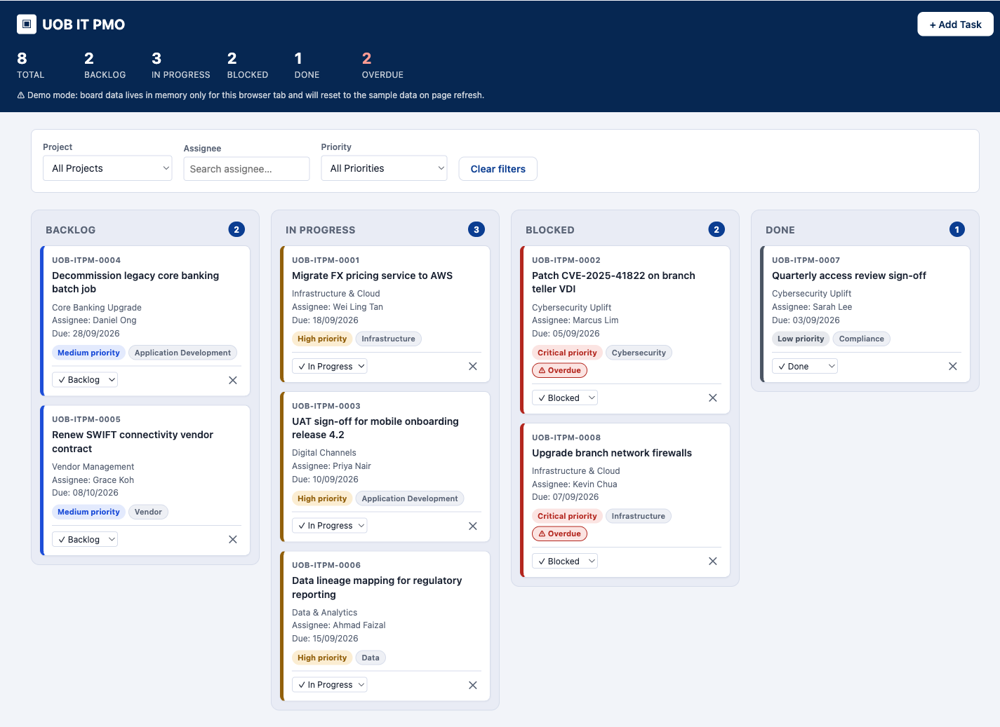

# training

**Live demo:** https://nikitarastogi3.github.io/training/

UOB IT PMO Kanban board — a single-file (`index.html`) internal demo/training tool for an IT project management board. Vanilla HTML/CSS/JS only, no build step, no backend beyond a FormSubmit AJAX call for new-task email notifications. Open `index.html` directly in a browser to run it.

See [CLAUDE.md](CLAUDE.md) for architecture notes.
